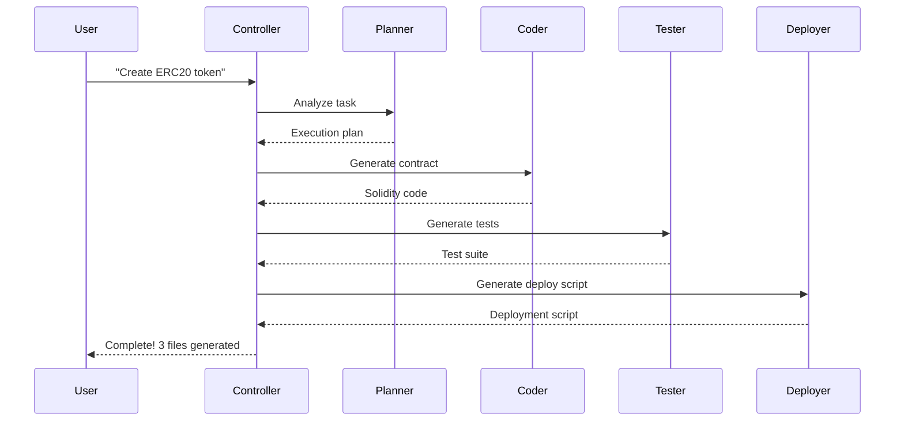

# Web3 AI Multi-Agent System

<div align="center">


**AI-Powered Multi-Agent System for Automated Smart Contract Development**

[Features](#features) • [Quick Start](#quick-start) • [Architecture](#architecture) • [Documentation](#documentation) • [Contributing](#contributing)

</div>

---

## Table of Contents

- [Overview](#overview)
- [Features](#features)
- [Quick Start](#quick-start)
- [Architecture](#architecture)
- [Usage](#usage)
- [Project Structure](#project-structure)
- [Technical Stack](#technical-stack)
- [Documentation](#documentation)
- [Development](#development)
- [Contributing](#contributing)
- [License](#license)

---

## Overview

**Web3 AI Multi-Agent System** is an AI-powered development framework that automates the entire smart contract development lifecycle. By leveraging multiple specialized AI agents working in coordination, it transforms natural language descriptions into production-ready Solidity smart contracts, comprehensive test suites, and deployment scripts.

### What Makes It Different

Unlike traditional code generators that produce boilerplate templates, our Multi-Agent System uses intelligent planning and analysis to understand your requirements and generate customized, production-ready code that follows security best practices and industry standards.

### Key Benefits

- 🚀 **10x Faster Development** - Generate complete smart contracts in seconds
- 🧠 **Intelligent Analysis** - AI understands your requirements in natural language
- ✅ **Production-Ready** - Code follows security best practices
- 🧪 **Comprehensive Testing** - Automated test suite generation
- 📦 **One-Command Deployment** - Ready-to-deploy scripts for any network

---

## Features

### Multi-Agent Architecture

Our system orchestrates four specialized AI agents, each handling a specific aspect of smart contract development:

#### 🧠 Planner Agent
- **Analyze** user requirements from natural language input
- **Identify** contract type (ERC20, ERC721, DAO, Voting, etc.)
- **Extract** specifications and custom parameters
- **Generate** detailed execution plans
- **Validate** requirements before code generation

#### 💻 Coder Agent
- **Generate** production-ready Solidity smart contracts
- **Follow** OpenZeppelin security standards
- **Support** multiple contract templates and patterns
- **Include** comprehensive code documentation
- **Implement** security best practices (access control, reentrancy guards, etc.)

#### 🧪 Tester Agent
- **Create** comprehensive test suites using Hardhat and ethers.js
- **Cover** edge cases and security scenarios
- **Generate** readable and maintainable test code
- **Include** setup, teardown, and helper functions
- **Follow** testing best practices

#### 🚀 Deployer Agent
- **Generate** deployment scripts for all networks
- **Support** Etherscan contract verification
- **Include** deployment record tracking
- **Handle** network-specific configurations
- **Provide** error handling and logging

### Supported Contract Types

| Type | Description | Use Cases |
|------|-------------|-----------|
| **ERC20** | Fungible Token | DeFi tokens, governance tokens, reward tokens |
| **ERC721** | Non-Fungible Token (NFT) | Digital art, collectibles, gaming assets |
| **DAO** | Decentralized Autonomous Organization | Community governance, decentralized decisions |
| **Voting** | Time-based Voting System | Proposal voting, decision making |

### Additional Features

- 🎯 **CLI Interface** - Simple command-line interface for all operations
- 📦 **Batch Processing** - Generate multiple contracts in one command
- 📊 **Execution Reports** - Detailed JSON reports of all generations
- 🔄 **Extensible** - Easy to add new agents and contract types
- 🛡️ **Security First** - All generated code follows security best practices

---

## Quick Start

### Prerequisites

Before you begin, ensure you have the following installed:

- **Node.js** >= 18.0.0
- **npm** or **yarn** package manager
- **Git** for version control

### Installation

```bash
# Clone the repository
git clone https://github.com/hobostay/web3-ai-agent.git
cd web3-ai-agent

# Install dependencies
npm install

# Compile existing contracts
npx hardhat compile

# Run tests to verify setup
npm test
```

### Basic Usage

#### Generate an ERC20 Token

```bash
node agent/agent.js "创建ERC20代币 MyToken"
```

**Output:**
```
======================================================================
🤖 Web3 AI Agent - Multi-Agent System
======================================================================

📝 Task: "创建ERC20代币 MyToken"

──────────────────────────────────────────────────────────────────────
🧠 Step 1: Planning
──────────────────────────────────────────────────────────────────────
✓ Type: ERC20
✓ Contract: MyToken
✓ Plan generated with 6 steps

──────────────────────────────────────────────────────────────────────
💻 Step 2: Coding
──────────────────────────────────────────────────────────────────────
✓ Contract generated: MyToken.sol

──────────────────────────────────────────────────────────────────────
🧪 Step 3: Testing
──────────────────────────────────────────────────────────────────────
✓ Test file generated: MyToken.test.js

──────────────────────────────────────────────────────────────────────
🚀 Step 4: Deployment
──────────────────────────────────────────────────────────────────────
✓ Deploy script generated: deploy-MyToken.js

======================================================================
✅ Complete! Generated 3 files in 1.5s
======================================================================
```

#### Generate an NFT Contract

```bash
node agent/agent.js "创建NFT合约 MyNFT"
```

#### Generate a DAO Contract

```bash
node agent/agent.js "创建DAO合约 MyDAO"
```

#### Batch Processing

```bash
node agent/agent.js "创建ERC20代币 Token1" "创建NFT合约 NFT1" "创建DAO合约 DAO1"
```

### Next Steps

After generation, you can:

```bash
# 1. Review the generated contract
cat contracts/MyToken.sol

# 2. Run tests
npx hardhat test test/MyToken.test.js

# 3. Compile contracts
npx hardhat compile

# 4. Deploy to local network
npx hardhat node                          # Terminal 1
npx hardhat run scripts/deploy-MyToken.js --network localhost  # Terminal 2

# 5. Deploy to testnet
npx hardhat run scripts/deploy-MyToken.js --network sepolia
```

---

## Architecture

### System Flow Diagram

```
┌─────────────────────────────────────────────────────────────────┐
│                     User Input (Natural Language)               │
│                  "创建ERC20代币 MyToken"                        │
└────────────────────────────────┬────────────────────────────────┘
                                 ↓
┌─────────────────────────────────────────────────────────────────┐
│              Multi-Agent Controller (Orchestrator)              │
│                     coordinates all agents                      │
└────────────────────────────────┬────────────────────────────────┘
                                 ↓
         ┌───────────────────────┼───────────────────────┐
         │                       │                       │
         ↓                       ↓                       ↓
┌────────────────┐    ┌────────────────┐    ┌────────────────┐
│  Planner Agent │    │   Coder Agent  │    │  Tester Agent  │
│                │    │                │    │                │
│ • Task Analysis│───→│• Solidity Gen  │───→│• Test Suite    │
│ • Type Detect  │    │• Best Practices│    │• Edge Cases    │
│ • Plan Generate│    │• Security      │    │• Documentation │
└────────────────┘    └────────────────┘    └────────────────┘
                                                      │
                                                      ↓
                                            ┌────────────────┐
                                            │ Deployer Agent │
                                            │                │
                                            │• Deploy Scripts│
                                            │• Multi-Network │
                                            │• Verification  │
                                            └────────────────┘
```

### Agent Communication Flow



---

## Usage

### Command-Line Interface

The system provides two command-line interfaces:

#### 1. Legacy CLI (Recommended for most users)

```bash
node agent/agent.js "Your task description"
```

#### 2. Multi-Agent CLI (Direct access)

```bash
node agent/multi-agent.js "Your task description"
```

### Command Options

```bash
# Single contract
node agent/agent.js "创建ERC20代币 TokenName"

# Multiple contracts (batch mode)
node agent/agent.js "任务1" "任务2" "任务3"

# View help
node agent/agent.js --help
```

### Supported Languages

The system currently supports:
- 🇨🇳 **Chinese** - Simplified Chinese (优先支持)
- 🇺🇸 **English** - English (实验性支持)

---

## Project Structure

```
web3-ai-agent/
├── agent/                          # Multi-Agent System Core
│   ├── agent.js                   # Legacy CLI entry point
│   ├── multi-agent.js             # Multi-Agent controller
│   ├── planner.js                 # Planner agent implementation
│   ├── executor.js                # Plan executor
│   ├── index.js                   # Main agent class
│   ├── analyzers/                 # Task analysis modules
│   │   └── taskAnalyzer.js        # Task analyzer
│   ├── planners/                  # Plan generation modules
│   │   └── planGenerator.js       # Plan generator
│   ├── coders/                    # Contract generation
│   │   └── coder.js               # Solidity code generator
│   ├── testers/                   # Test generation
│   │   └── tester.js              # Test file generator
│   └── deployers/                 # Deployment scripts
│       └── deployer.js            # Deploy script generator
│
├── contracts/                     # Generated & Example Contracts
│   ├── MyToken.sol               # ERC20 token example
│   ├── Web3NFT.sol               # ERC721 NFT example
│   └── VotingDAO.sol             # DAO voting example
│
├── test/                         # Generated & Example Tests
│   ├── MyToken.test.js           # ERC20 token tests
│   ├── Web3NFT.test.js           # NFT tests
│   └── VotingDAO.test.js         # DAO tests
│
├── scripts/                      # Deployment & Utility Scripts
│   ├── deploy.js                 # Main deploy script
│   ├── deploy-token.js           # Token deployment
│   └── deploy-*.js               # Generated deploy scripts
│
├── reports/                      # Execution Reports (gitignored)
├── deployments/                  # Deployment Records (gitignored)
│
├── hardhat.config.js            # Hardhat configuration
├── package.json                 # Project dependencies
├── .gitignore                   # Git ignore rules
├── .env.example                 # Environment variables template
│
├── README.md                    # This file
├── CHANGELOG.md                 # Version history & changes
├── MULTI_AGENT_GUIDE.md         # Complete Multi-Agent guide
├── MULTI_AGENT_QUICK_REF.md     # Quick reference
├── AGENT_CLI_GUIDE.md           # CLI documentation
├── PLANNER_GUIDE.md             # Planner agent guide
│
└── LICENSE                      # MIT License
```

---

## Technical Stack

### Blockchain & Smart Contracts

| Technology | Version | Purpose |
|------------|---------|---------|
| **Solidity** | ^0.8.0 | Smart contract language |
| **Hardhat** | ^2.22.0 | Ethereum development environment |
| **Ethers.js** | ^6.16.0 | Blockchain interaction library |
| **OpenZeppelin** | ^5.4.0 | Secure contract library |

### Development Tools

| Technology | Version | Purpose |
|------------|---------|---------|
| **Node.js** | >= 18.x | JavaScript runtime |
| **npm** | Latest | Package manager |
| **Chai** | ^4.5.0 | Testing framework |
| **Mocha** | Latest | Test runner |

### Agent System

- **Modular Architecture** - Each agent is independent and reusable
- **Async/Await** - Non-blocking execution for better performance
- **Error Handling** - Comprehensive error handling and recovery
- **Progress Tracking** - Real-time status updates and logging

---

## Documentation

### Core Documentation

- 📖 **[Multi-Agent Guide](MULTI_AGENT_GUIDE.md)** - Complete system documentation
- 📋 **[Quick Reference](MULTI_AGENT_QUICK_REF.md)** - Command cheat sheet
- 🧠 **[Planner Guide](PLANNER_GUIDE.md)** - Planner agent deep dive
- 💻 **[CLI Guide](AGENT_CLI_GUIDE.md)** - CLI usage documentation

### Additional Resources

- **[Hardhat Docs](https://hardhat.org/getting-started/)** - Hardhat framework
- **[Ethers.js Docs](https://docs.ethers.org/)** - Blockchain interaction
- **[OpenZeppelin](https://docs.openzeppelin.com/contracts/)** - Smart contract library
- **[Solidity Docs](https://docs.soliditylang.org/)** - Solidity language

---

## Development

### Setting Up Development Environment

```bash
# Clone repository
git clone https://github.com/hobostay/web3-ai-agent.git
cd web3-ai-agent

# Install dependencies
npm install

# Run linter (if configured)
npm run lint

# Run tests
npm test

# Run test coverage
npm run test:coverage
```

### Adding New Contract Types

1. Create template in `agent/coders/coder.js`
2. Add test template in `agent/testers/tester.js`
3. Update planner type detection
4. Add documentation
5. Submit PR

### Adding New Agents

1. Create agent file in `agent/{type}/`
2. Implement agent interface
3. Register in `multi-agent.js`
4. Add tests
5. Update documentation

---

## Contributing

We welcome contributions! Please see our [Contributing Guidelines](CONTRIBUTING.md) for details.

### How to Contribute

1. **Fork** the repository
2. **Create** a feature branch (`git checkout -b feature/amazing-feature`)
3. **Commit** your changes (`git commit -m 'Add amazing feature'`)
4. **Push** to the branch (`git push origin feature/amazing-feature`)
5. **Open** a Pull Request

### Development Guidelines

- Write tests for new features
- Follow existing code style
- Update documentation
- Ensure all tests pass

### Reporting Issues

Found a bug? Have a feature request? Please [open an issue](https://github.com/hobostay/web3-ai-agent/issues).

---

## License

This project is licensed under the MIT License - see the [LICENSE](LICENSE) file for details.

---

## Acknowledgments

- Built with [Hardhat](https://hardhat.org/)
- Smart contracts powered by [OpenZeppelin](https://openzeppelin.com/)
- Blockchain interaction via [ethers.js](https://docs.ethers.org/)

---

## Roadmap

### ✅ Current Features

- Multi-Agent architecture
- Natural language task processing
- Automatic contract generation
- Comprehensive test generation
- Deployment script generation
- CLI interface
- Batch processing
- Execution reports

### 🚧 Planned Features

- [ ] LLM integration (GPT-4, Claude, Gemini)
- [ ] Custom contract templates
- [ ] Gas optimization suggestions
- [ ] Security audit integration
- [ ] Web-based management UI
- [ ] Multi-chain deployment support
- [ ] Agent marketplace
- [ ] Contract verification automation
- [ ] Advanced analytics dashboard

---

## Contact & Support

- 📧 Email: support@web3ai-agent.com
- 🐦 Twitter: [@web3aiagent](https://twitter.com/web3aiagent)
- 💬 Discord: [Join our community](https://discord.gg/web3aiagent)
- 📖 Documentation: [docs.web3aiagent.com](https://docs.web3aiagent.com)

---

<div align="center">

**Built with ❤️ by the Web3 AI Agent team**

[⬆ Back to Top](#web3-ai-multi-agent-system)

**⭐ Star us on GitHub** — it helps!

[](https://star-history.com/#hobostay/web3-ai-agent&Date)

</div>
